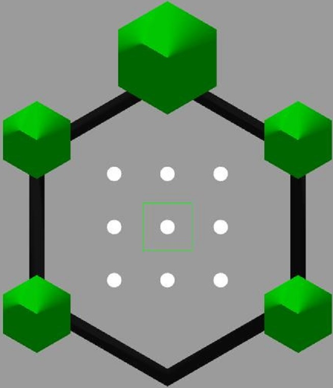
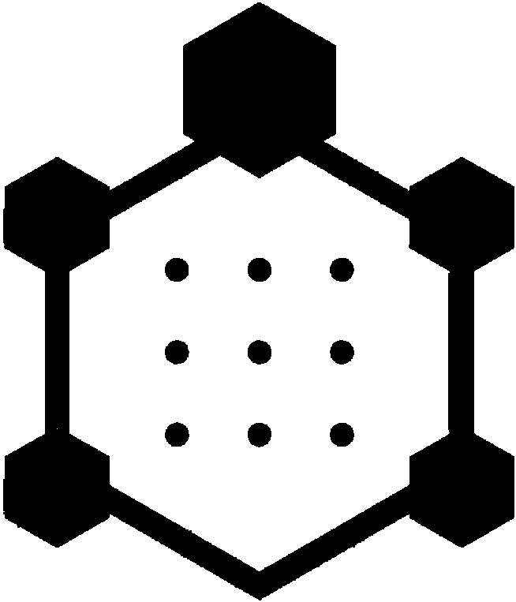
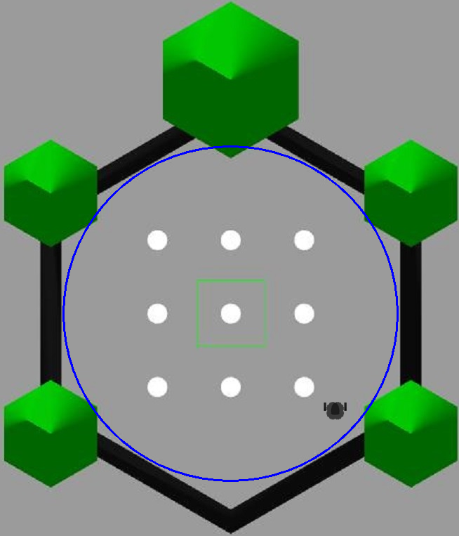
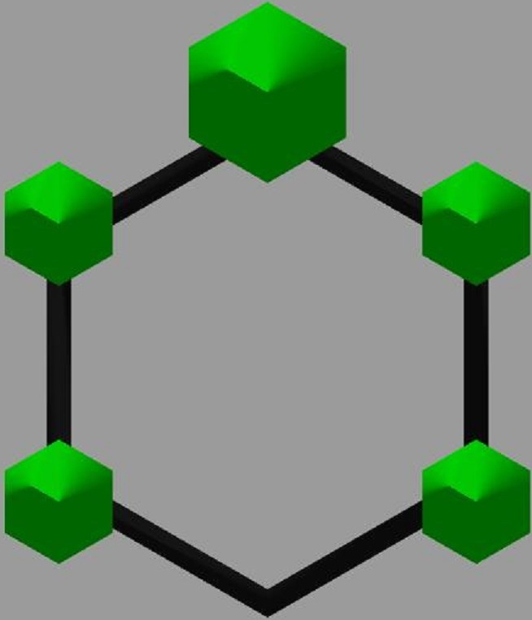

## Introduction


Given the world shown above, navigate robot within the gray areas, within the bounds of the green pillars and black 
walls. The white circles indicates obstacles. 



We converted the original map to a grayscale version using computer vision techniques. Now the white space indicates 
movable areas while the black circles within the wall indicates the obstacles. See the file `rl_map.ipynb` for details.



We design our agent (_robot_) to have a certain diameter with a pose (x, y, theta) as can be seen in the image above.

With this background information do we build our world having the following additional properties.
1. Our observation space given by _x_, _y_ and _theta_ indicating the robot's current pose and the target position specified by its _x_ and _y_ coordinates. 
2. _x_ and _y_ have a range of (0 to the maximum _x_ & _y_ coordinates of the world), while theta has a range of (`-pi` to `pi`)
3. The action space is given by the linear (`v`) and angular velocity (`w`) of the robot.
4. `v` and `w` are designed to be continous between _0_ to _1_ for `v` and _-1_ to _1_ for `w`. These based values are scaled by 20 - 100 for v and 3 for w, in some World implementations. 
5. The initial robot pose and the target pose are initialized randomly within the movable area, with only two constraints.
   1. The robot pose and the target pose should not be equivalent
   2. The robot pose and the target pose should not be on the walls or obstacles.
6. We calculate the reward signal as a function of the euclidean distance to the target. 
7. We set a threshold of 3units to acceptable target and robot location equivalence.
8. Given an action (_v, w_), new position and orientation are calculated using the integration approximation formula 
   ```
   x0, y0, t0 = robot_pose 
   x = x0 + v*cos(t0 + 0.5*w)
   y = y0 + v*sin(t0 + 0.5*w)
   t = t0 + w   //wrapped to values between -pi to pi
   ```
   
### Reward System
Walls and all obstacles are assigned a negative reward `-10`. The `step` method also sends a done signal when reward is 
negative.
Rewards for the navigable region are calculated in two sections as explained below.
#### Distance Reward
This calculates the distance between robot pose and target location and generates a reward from it.
```
distance = sqrt(((xg - x)^2) + ((yg - y)^2))
reward = 1/(1 + distance)
```
By this system, rewards are always between 0 and 1. When robot is close to target, the distance is zero, which in turn yields `reward = 1/(1 + 0) = 1/1 = 1`.

Conversely, as robot moves farther from goal, distance becomes large, and reward tends to zero. `reward = 1/(1 + inf) ~= 1/inf ~= 0`

#### Bearing reward. 
We generate another reward which is a function of the robot's orientation and the orientation it needs to take in order 
to align with the target. This reward is also set between 0 and 1. 0 for when the robot's orientation is completely 
offset, and 1 for when it is aligned to the target. 
Given robot pose denoted as `x, y, theta` and goal location denoted as `xg, yg`, we calculate reward as
```
bearing = arctan2(yg - y, xg - x)
error = bearing - theta
```
This gives an error between `0` and `pi`, which we then we normalize this error to values between `0` and `1`
```
error = error/pi
reward = 1 - error
```
With the above system, the highest error is 1 and the lowest 0 and similarly, highest reward is 1 and lowest is 0.

The distance reward is then added to the bearing reward to obtain a maximum of 2 and a minimum of 0.


## Helpers
### Workspace Setup
Set up a `conda` environment. 

To activate terminal.
```
conda activate bot3RLNavigation
```

Install `gym` using the code below. See [here](https://anaconda.org/conda-forge/gym) for details.
```
conda install -c conda-forge gym
```

To create requirements file. See [More](https://linuxhint.com/conda-install-requirements-txt/)
```
conda list -e > requirements.txt
```

For `pip`, use
```
pip freeze > pip_reqs.txt
```

You can create an environment for work using this package's requirements via
```
conda create --name <env> --file requirements.txt
```

Install `opencv`. See [here](https://anaconda.org/conda-forge/opencv) for details.
```
conda install -c conda-forge opencv
```

Install `PILLOW` See [here](https://anaconda.org/conda-forge/pillow) for details
```
conda install -c conda-forge pillow
```

Install `stable-baseline3` See [here](https://anaconda.org/conda-forge/stable-baselines3) for more details.
```
conda install -c conda-forge stable-baselines3
```

### Gym Environment Registration
In the `__init__.py` file in `envs` add an import statement to your created world.  
In the package's `__init__.py` supply the `id`, `entry_point` and other necessary options for your environment.  
After registration, our custom World environment can be created with 
```
env = gym.make('id')
```
See the mentioned `__init__` files for details.

### Simulation
To render simulation using `World-v2`, use the format below
```
env.reset()
name = "bot3"
cv2.namedWindow(name)
rate = 500  # frame rate in ms
while True:
    frame = env.render(mode="rgb_array")
    cv2.imshow("bot3", frame)
    cv2.waitKey(rate)
    action = env.action_space.sample() # random (or use policy)
    obs, reward, done, info step = env.step(action)
    if done:
      frame = env.render(mode="rgb_array")
      cv2.imshow("bot3", frame)
      cv2.waitKey(rate)
      break
```

### Map Version
Two map versions exist. The map shown in the preceeding sections (with obstalces), and another shown below, 
(without obstacles). The `env` can be created using the code fragment below.  
Has been tested on `World-v1` and should work with this version and above, with all it's subclasses.
```
env = gym.make('bot3RLNav/World-v2', map_file="data/map01.jpg",
             robot_file="data/robot.png")
```


### Resetting
To set fixed targets use the code block below. This feature means, the robot initial pose and the target location are 
always reset to the same first poses that the preceeding `.reset()` call made.
```
env = gym.make(...)
env.reset(options={'reset': False})
# or env.reset(options=dict(reset=False))
```
Works on `v0` and all the subclasses.

## References
1. [Custom Environment](https://www.gymlibrary.dev/content/environment_creation/)
2. [Spaces](https://www.gymlibrary.dev/api/spaces/)
3. [Gym Github](https://github.com/openai/gym)
4. [Markdown](https://daringfireball.net/projects/markdown/)
5. [Create CV Window](https://docs.opencv.org/4.x/d7/dfc/group__highgui.html#ga5afdf8410934fd099df85c75b2e0888b)
6. [CV imshow](https://docs.opencv.org/4.x/d7/dfc/group__highgui.html#ga453d42fe4cb60e5723281a89973ee563)
