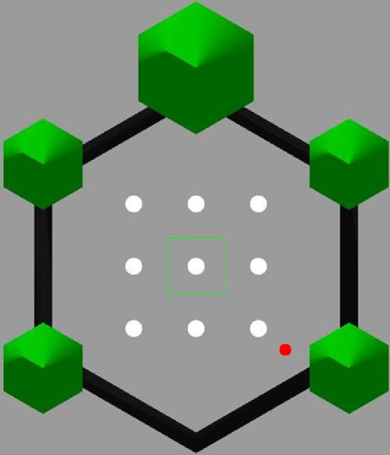

## Introduction


Given the world shown above, navigate robot within the gray areas, within the bounds of the green pillars and black 
walls. The white circles indicates obstacles. 


We converted the original map to a grayscale version using computer vision techniques. Now the white space indicates 
movable areas while the black circles within the wall indicates the obstacles. See the file `rl_map.ipynb` for details.



We design our agent (_robot_) to have a certain diameter with a pose (x, y, theta). The agent is indicated by the red 
spot in the image above.

With this background information do we build our world having the following additional properties.
1. Our observation space given by _x_, _y_ and _theta_ indicating the robot's current pose and the target position specified by its _x_ and _y_ coordinates. 
2. _x_ and _y_ have a range of (0 to the maximum _x_ & _y_ coordinates of the world), while theta has a range of (`-pi` to `pi`)
3. The action space is given by the linear (`v`) and angular velocity (`w`) of the robot.
4. `v` and `w` are designed to be continous between _0_ to _1_ for `v` and _-1_ to _1_ for `w`.
5. The initial robot pose and the target pose are initialized randomly within the movable area, with only two constraints.
   1. The robot pose and the target pose should not be equivalent
   2. The robot pose and the target pose should not be on the walls or obstacles.
6. We calculate the reward signal as a function of the euclidean distance to the target. 
7. We set a threshold of 3units to acceptable target and robot location equivalence.
8. Given an action (_v, w_), new position and orientation are calculated using the integration approximation formula 
   ```
   x0, y0, t0 = robot_pose 
   x = x0 + v*cos(t0 + 0.5*w)
   y = y0 + v*sin(t0 + 0.5*w)
   t = t0 + w   //wrapped to values between -pi to pi
   ```

## Helpers
### Workspace Setup
Set up a `conda` environment. 

To activate terminal.
```
conda activate bot3RLNavigation
```

Install `gym` using the code below. See [here](https://anaconda.org/conda-forge/gym) for details.
```
conda install -c conda-forge gym
```

To create requirements file. See [More](https://linuxhint.com/conda-install-requirements-txt/)
```
conda list -e > requirements.txt
```

You can create an environment for work using this package's requirements via
```
conda create --name <env> --file requirements.txt
```

Install `opencv`. See [here](https://anaconda.org/conda-forge/opencv) for details.
```
conda install -c conda-forge opencv
```

### Gym Environment Registration
In the `__init__.py` file in `envs` add an import statement to your created world.  
In the package's `__init__.py` supply the `id`, `entry_point` and other necessary options for your environment.  
After registration, our custom World environment can be created with 
```
env = gym.make('id')
```
See the mentioned `__init__` files for details.


## References
1. [Custom Environment](https://www.gymlibrary.dev/content/environment_creation/)
2. [Spaces](https://www.gymlibrary.dev/api/spaces/)
3. [Gym Github](https://github.com/openai/gym)
4. [Markdown](https://daringfireball.net/projects/markdown/)
